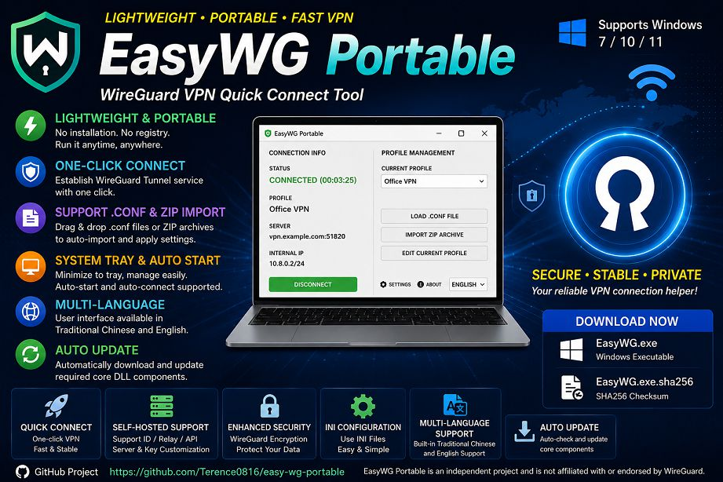
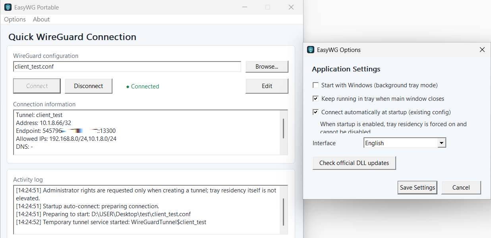
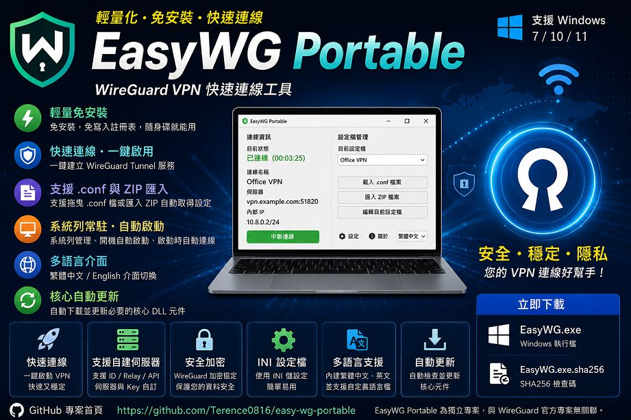
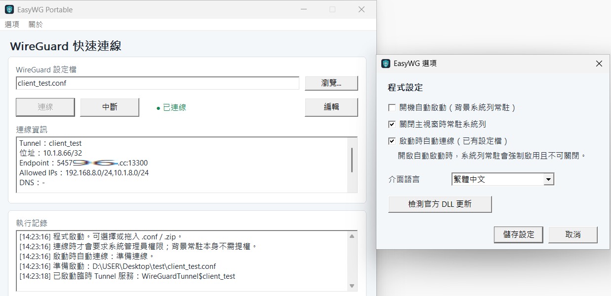

# EasyWG Portable

Lightweight and portable WireGuard quick-connect client for Windows 7 / 10 / 11.

[](https://github.com/Terence0816/easy-wg-portable/releases) | [Releases](https://github.com/Terence0816/easy-wg-portable/releases) | [Latest Official Build `v0.2.8.10`](https://github.com/Terence0816/easy-wg-portable/releases/download/v0.2.8.10/EasyWG.exe) | [MIT License](./LICENSE)

English | [繁體中文](#zh-tw)



EasyWG Portable is a lightweight **WireGuard VPN quick-connect tool for Windows**.

It is designed for users who want a simple portable workflow without installing the full WireGuard desktop application. Select or drag in a standard `.conf` file, connect with one click, and let EasyWG handle the required tunnel service and core components.

> EasyWG Portable is an independent, unofficial project and is not affiliated with or endorsed by the WireGuard project.

## Version History

### v0.2.8.10

- Improved the `wireguard.dll` download flow
  - On Windows 10 / 11, EasyWG still tries to download `wireguard.dll` from the official WireGuard source first.
  - If the official download fails, EasyWG now automatically falls back to the EasyWG GitHub `core-v1` backup source.
  - This helps reduce first-launch failures caused by network, firewall, TLS, or official download source connection issues.

- Fixed possible main window flickering while idle
  - Reduced unnecessary per-second UI repainting.
  - Status text, connection information, and log content are no longer refreshed when unchanged.
  - Improved visual stability of the main window when no user action is being performed.


### v0.2.8.8

- Added Windows 7 compatibility support.
- Added a dedicated Windows 7 Legacy WireGuard core path:
  - `tunnel-win7.dll`
  - `wintun.dll`
- Windows 10 / 11 continue to use the WireGuardNT path:
  - `tunnel.dll`
  - `wireguard.dll`
- Added automatic Windows 7 core component handling.
- Added a dedicated Windows 7 core DLL update-checking path.
- Improved Windows 7 Tunnel Service startup and `.conf` compatibility.
- Added Windows 7 Tunnel Service diagnostic logging.
- Improved UI layout compatibility on Windows 7 / 10 / 11.
- Improved the full build workflow for both Win7 and Win10/11 core components.

### v0.2.7.2

- Added automatic first-run download of required core components.
- `tunnel.dll` is obtained from the EasyWG Portable GitHub core release.
- `wireguard.dll` is obtained from the official WireGuardNT source.
- Added clickable GitHub project link in the About window.
- Added Windows file version and product metadata.
- Added centralized version synchronization through `ver.txt`.
- Improved the component download window and About window layout.

## Highlights

- Lightweight portable Windows application
- No traditional installer required
- One-click WireGuard VPN connect / disconnect
- Supports standard WireGuard `.conf` files
- Drag-and-drop `.conf` loading
- ZIP import with automatic `.conf` extraction
- Direct editing of the current configuration file
- System tray resident mode
- Auto start with Windows
- Auto connect on startup
- Traditional Chinese / English UI
- Portable INI settings
- Relative configuration paths for easy folder sharing
- Automatic required core component download
- Core DLL update checking
- Windows 7 / 10 / 11 support
- Automatic VPN disconnect and temporary Tunnel service cleanup on exit

## English Interface



## How to Use

1. Download `EasyWG.exe` from the official [Releases](https://github.com/Terence0816/easy-wg-portable/releases) page.
2. Run `EasyWG.exe`.
3. On first launch, EasyWG automatically obtains the required core components when they are missing.
4. Select, browse to, or drag in a WireGuard `.conf` file.
5. You may also import a `.zip` archive containing one or more `.conf` files.
6. Click **Connect**.
7. Administrator privileges are requested only when required to create the Tunnel service.

## Windows Core Architecture

EasyWG automatically uses the appropriate core path for the current Windows version.

### Windows 10 / 11

```text
EasyWG.exe
├─ tunnel.dll
└─ wireguard.dll
```

- Uses the WireGuardNT-based path.
- `tunnel.dll` is distributed through the EasyWG Portable core release.
- `wireguard.dll` is obtained from the official WireGuardNT source.

### Windows 7

```text
EasyWG.exe
├─ tunnel-win7.dll
└─ wintun.dll
```

- Uses a Legacy compatibility path.
- Uses the historical WireGuard userspace / Wintun architecture.
- Windows 7 core update checking is handled separately from Windows 10 / 11.

> Windows 7 SP1 with working TLS 1.2 system updates is recommended.

## Automatic Core Component Download

EasyWG Portable keeps the main executable lightweight and does not embed the core DLL files directly into `EasyWG.exe`.

When required components are missing, EasyWG automatically obtains the appropriate files for the current Windows version.

This allows a simple portable workflow such as:

```text
EasyWG.exe
client.conf
```

On first launch, missing core components are downloaded automatically.

## Portable Configuration

EasyWG stores application settings in:

```text
EasyWG.ini
```

Supported options include:

- Stay resident in the system tray
- Start automatically with Windows
- Auto connect on startup
- Traditional Chinese / English interface
- Saved configuration file path

When a `.conf` file is located in the same directory as `EasyWG.exe`, EasyWG stores and displays the relative filename instead of an absolute path.

Example:

```text
EasyWG.exe
EasyWG.ini
client.conf
```

This makes it easy to package a ready-to-use portable folder for another computer.

## ZIP Import

EasyWG supports importing `.zip` archives containing WireGuard `.conf` files.

The selected configuration is extracted and made available for quick connection.

This is useful when distributing VPN profiles as a single archive.

## System Tray and Auto Start

EasyWG can stay resident in the Windows system tray.

Tray menu options include:

- Show main window
- Exit

When Windows auto-start is enabled:

- EasyWG can start directly in the system tray
- The main window does not need to appear
- Auto-connect can be enabled when a valid configuration file is already set

## Repository Layout

- `src/`: native C++ Win32 source code
- `res/`: application icon and image resources
- `assets/screenshots/`: README cover images and screenshots

## Download

- Release page: [Releases](https://github.com/Terence0816/easy-wg-portable/releases)
- Official `v0.2.8.8` build: [EasyWG.exe](https://github.com/Terence0816/easy-wg-portable/releases/download/v0.2.8.8/EasyWG.exe)
- SHA256 checksum: available from the corresponding GitHub Release assets
- GitHub Release assets show the current per-file download count

## Security Notice

WireGuard `.conf` files may contain a plaintext:

```ini
PrivateKey = ...
```

Keep configuration files secure and do not upload private VPN profiles to public repositories.

EasyWG creates a temporary Windows Tunnel service when connecting and removes it when disconnecting or exiting.

Please download builds only from the official GitHub Releases page and verify the digital signature and SHA256 checksum when available.

## Search Keywords

WireGuard portable client, WireGuard quick connect, Windows WireGuard VPN, portable VPN client, WireGuard conf launcher, WireGuard ZIP import, Windows 7 WireGuard, Windows 10 WireGuard, Windows 11 WireGuard, WireGuardNT client, Wintun VPN, native C++ Win32 VPN tool, system tray WireGuard, auto connect VPN

## Disclaimer

EasyWG Portable is an independent, unofficial project.

It is not affiliated with, endorsed by, or officially maintained by the WireGuard project.

WireGuard is a trademark of its respective owner.

Use this software only with VPN configurations and systems you are authorized to access.

## License

This repository is released under the MIT License. See [LICENSE](./LICENSE).

---

<a id="zh-tw"></a>

# 繁體中文



EasyWG Portable 是一款輕量化、免傳統安裝的 **Windows WireGuard VPN 快速連線工具**。

主要設計給希望簡化 WireGuard 連線流程的使用者。選擇或直接拖入標準 `.conf` 設定檔後，即可一鍵建立 VPN 連線，必要的 Tunnel 服務與核心元件由 EasyWG 自動處理。

> EasyWG Portable 為獨立、非官方專案，與 WireGuard 官方專案無隸屬或背書關係。

## 版本更新紀錄

### v0.2.8.8

- 改善 `wireguard.dll` 下載流程
  - Windows 10 / 11 缺少 `wireguard.dll` 時，仍會優先嘗試從 WireGuard 官方來源取得。
  - 若官方來源下載失敗，會自動改用 EasyWG GitHub `core-v1` 備援來源下載。
  - 可降低部分環境因網路、防火牆、TLS 或官方下載站連線問題導致首次啟動失敗的情況。

- 修復主視窗閒置時可能持續閃動的問題
  - 減少不必要的每秒 UI 重繪。
  - 狀態文字、連線資訊與紀錄內容未變更時，不再重複刷新。
  - 改善主視窗在未操作時的穩定顯示效果。

### v0.2.8.8

- 新增 Windows 7 相容支援。
- 新增 Windows 7 專用 Legacy WireGuard 核心路線：
  - `tunnel-win7.dll`
  - `wintun.dll`
- Windows 10 / 11 維持 WireGuardNT 路線：
  - `tunnel.dll`
  - `wireguard.dll`
- 新增 Windows 7 核心元件自動處理。
- 新增 Windows 7 專用核心 DLL 更新檢測。
- 改善 Windows 7 Tunnel Service 啟動與 `.conf` 相容性。
- 新增 Windows 7 Tunnel Service 診斷紀錄。
- 改善 Windows 7 / 10 / 11 介面版面相容性。
- 改善 Win7 與 Win10/11 核心元件完整建置流程。

### v0.2.7.2

- 新增首次執行時自動下載必要核心元件。
- `tunnel.dll` 從 EasyWG Portable GitHub 核心發行版本取得。
- `wireguard.dll` 從 WireGuardNT 官方來源取得。
- 關於視窗新增可點擊的 GitHub 專案連結。
- 新增 Windows 檔案版本與產品資訊。
- 新增透過 `ver.txt` 集中同步程式版本。
- 改善元件下載視窗與關於視窗版面。

## 功能特色

- 輕量化 Portable Windows 應用程式
- 免傳統安裝
- 一鍵建立 / 中斷 WireGuard VPN
- 支援標準 WireGuard `.conf` 設定檔
- 支援拖曳 `.conf` 快速載入
- 支援 ZIP 匯入並自動取得 `.conf`
- 可直接編輯目前設定檔
- 系統列常駐
- Windows 開機自動啟動
- 啟動時自動連線
- 繁體中文 / English 介面
- Portable INI 設定
- 同目錄設定檔支援相對路徑
- 自動下載必要核心元件
- 核心 DLL 更新檢測
- 支援 Windows 7 / 10 / 11
- 退出程式時自動中斷 VPN 並清理臨時 Tunnel 服務

## 中文介面



## 使用方式

1. 從官方 [Releases](https://github.com/Terence0816/easy-wg-portable/releases) 頁面下載 `EasyWG.exe`。
2. 執行 `EasyWG.exe`。
3. 第一次啟動時，若缺少核心元件，EasyWG 會自動取得目前 Windows 版本所需的元件。
4. 選擇、瀏覽或直接拖入 WireGuard `.conf` 設定檔。
5. 也可以匯入包含 `.conf` 的 `.zip` 壓縮檔。
6. 按下 **連線**。
7. 只有建立 Tunnel 服務時才會依需求要求系統管理員權限。

## Windows 核心架構

EasyWG 會依照目前 Windows 版本，自動使用對應核心路線。

### Windows 10 / 11

```text
EasyWG.exe
├─ tunnel.dll
└─ wireguard.dll
```

- 使用 WireGuardNT 路線。
- `tunnel.dll` 由 EasyWG Portable 核心發行版本提供。
- `wireguard.dll` 從 WireGuardNT 官方來源取得。

### Windows 7

```text
EasyWG.exe
├─ tunnel-win7.dll
└─ wintun.dll
```

- 使用 Legacy 相容模式。
- 採用歷史 WireGuard userspace / Wintun 架構。
- Windows 7 的核心更新檢測與 Windows 10 / 11 分開處理。

> 建議使用 Windows 7 SP1，並具備可正常使用 TLS 1.2 的系統更新。

## 自動取得核心元件

EasyWG Portable 為保持主程式輕量，不將核心 DLL 直接內嵌進 `EasyWG.exe`。

缺少必要元件時，EasyWG 會依目前 Windows 版本自動取得對應檔案。

因此可以使用非常簡單的 Portable 方式：

```text
EasyWG.exe
client.conf
```

第一次執行時，自動下載缺少的核心元件。

## Portable 設定

EasyWG 的程式設定儲存在：

```text
EasyWG.ini
```

可儲存：

- 系統列常駐
- Windows 開機自動啟動
- 啟動時自動連線
- 繁體中文 / English 介面
- 目前使用的設定檔路徑

當 `.conf` 位於 `EasyWG.exe` 同一目錄時，EasyWG 會儲存並顯示相對檔名，而不是完整絕對路徑。

例如：

```text
EasyWG.exe
EasyWG.ini
client.conf
```

很適合直接打包整個資料夾給其他電腦使用。

## ZIP 匯入

EasyWG 支援匯入包含 WireGuard `.conf` 的 `.zip` 壓縮檔。

設定檔會自動取出並提供快速連線使用。

適合把 VPN Profile 以單一壓縮檔方式提供給使用者。

## 系統列與自動啟動

EasyWG 可常駐 Windows 系統列。

系統列右鍵選單包含：

- 顯示主視窗
- 退出

啟用 Windows 開機自動啟動後：

- EasyWG 可直接在背景系統列啟動
- 不需要先顯示主視窗
- 已有有效設定檔時，可搭配「啟動時自動連線」

## 儲存庫結構

- `src/`：主要 C++ Win32 原始碼
- `res/`：程式圖示與圖片資源
- `assets/screenshots/`：README 封面與介面截圖
- `scripts/`：專案輔助腳本

## 下載

- 版本下載頁面：[Releases](https://github.com/Terence0816/easy-wg-portable/releases)
- 正式版 `v0.2.8.8`：[EasyWG.exe](https://github.com/Terence0816/easy-wg-portable/releases/download/v0.2.8.8/EasyWG.exe)
- SHA256 驗證碼：請查看對應 GitHub Release Assets
- GitHub Release Assets 可查看各檔案目前下載次數

## 安全提醒

WireGuard `.conf` 設定檔可能包含明文：

```ini
PrivateKey = ...
```

請妥善保管設定檔，不要把私人 VPN Profile 上傳到公開儲存庫。

EasyWG 連線時會建立臨時 Windows Tunnel 服務，斷線或退出程式時會進行清理。

建議只從官方 GitHub Releases 頁面下載，並在可用時確認數位簽章與 SHA256 驗證碼。

## 搜尋關鍵字

WireGuard 可攜式用戶端、WireGuard 快速連線、Windows WireGuard VPN、Portable VPN、WireGuard conf 啟動工具、WireGuard ZIP 匯入、Windows 7 WireGuard、Windows 10 WireGuard、Windows 11 WireGuard、WireGuardNT、Wintun、C++ Win32 VPN 工具、系統列 WireGuard、自動連線 VPN

## 免責聲明

EasyWG Portable 為獨立、非官方專案。

本專案並非 WireGuard 官方維護，也未獲 WireGuard 官方背書。

WireGuard 為其權利所有人的商標。

請只使用於你有權限存取的 VPN 設定與系統。

## 授權

本儲存庫使用 MIT License，詳見 [LICENSE](./LICENSE)。
